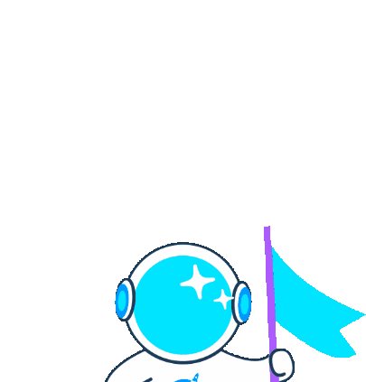

 

  <em>
	  I am a programmer with strong self-study abilities, and I have a profound passion for unearthing new things. I flourish in collaborative environments and always assume responsibility for my work 🎯. My repositories showcase a variety of creative endeavors where I investigate various aspects of programming. It goes beyond simple data visualization charts and includes enticing endeavors like developing games to obtain a better comprehension of programming languages 🌟. I perpetually seek out challenges to enhance my abilities and endeavor to develop them every day. Work contains enormous value for me, and I cannot imagine a day without it. The pursuit of becoming a better version of myself is a perpetual objective that propels me forward. 👨‍💻
  </em> 
   

	 <b><i>"Integrity and honesty form the very foundation of my character."</i></b> 

 

 

###  ***About Me***

* 😍 My hoppies: ***food - music - sport***
* 👨‍🚀 I love: ***Math -  Statist - Problem-solving***
* 📫 Ask me anything: [**here**](https://github.com/ducthinh17)

### Languages and Tools:

### 📫 Contact me via:

